  

<h1 align="center">Hi, I'm Denis</h1>

  <strong>Backend Engineer · Java / Go / Python</strong> 
  Building reliable APIs, data-intensive services and observable systems.

  
  
  

  

 

  

Java-focused backend developer building reliable and maintainable services across the full development lifecycle.

<table>
  <tr>
    <td width="48" align="center"></td>
    <td>Design and implement REST/gRPC APIs, business logic and data models.</td>
  </tr>
  <tr>
    <td width="48" align="center"></td>
    <td>Work with relational databases, schema migrations, caching and message brokers.</td>
  </tr>
  <tr>
    <td width="48" align="center"></td>
    <td>Implement authentication, authorization and service integrations.</td>
  </tr>
  <tr>
    <td width="48" align="center"></td>
    <td>Write unit and integration tests using JUnit, Mockito and Testcontainers.</td>
  </tr>
  <tr>
    <td width="48" align="center"></td>
    <td>Build containerized environments and configure logging, metrics and monitoring.</td>
  </tr>
  <tr>
    <td width="48" align="center"></td>
    <td>Collaborate through Git, work with existing codebases and maintain backward compatibility.</td>
  </tr>
</table>

 

  

  

 

  

  

| Area | Technologies |
| :--- | :--- |
| **Java** | Spring Boot, Spring Security, Spring Data JPA, Hibernate, jOOQ, REST, gRPC, JWT |
| **Go** | Gin, Chi, net/http, gRPC, GORM, goroutines, channels |
| **Python & ML** | FastAPI, Django, PyTorch, TensorFlow, scikit-learn, OpenCV |
| **Data & Messaging** | PostgreSQL, Redis, Kafka, SQL, Liquibase, Flyway |
| **Testing & Delivery** | JUnit, Mockito, Testcontainers, Docker Compose, OpenAPI, GitHub Actions |
| **Infrastructure & Observability** | Docker, Linux, Prometheus, Grafana, Spring Boot Actuator, structured logging |

 

  

<table>
  <tr>
    <td width="50%" valign="top">
      <h3> UdvCorpSocialBackend</h3>
      
Backend for a corporate social portal: employee profiles, organisational structure, communities, posts, projects and competency management.

      
<code>Java 21</code> <code>Spring Boot 3</code> <code>PostgreSQL</code> <code>MinIO</code> <code>Docker</code>

      <a href="https://github.com/WebStormUdv/UdvCorpSocialBackend"><strong>Explore repository →</strong></a>
    </td>
    <td width="50%" valign="top">
      <h3> CalorieTracker</h3>
      
Nutrition and activity tracker with food diary, calorie and macro calculations, goals, measurements, Redis caching and admin statistics.

      
<code>Java 21</code> <code>Spring Boot 3</code> <code>PostgreSQL</code> <code>Redis</code> <code>Thymeleaf</code>

      <a href="https://github.com/PracticeNaumen2025/CalorieTracker"><strong>Explore repository →</strong></a>
    </td>
  </tr>
  <tr>
    <td colspan="2" valign="top">
      <h3> BFF Gateway</h3>
      
Microservice backend with a BFF layer and User/Auth, Product and Order services. Combines HTTP and gRPC communication, PostgreSQL persistence, Redis caching and Prometheus/Grafana observability.

      
<code>Go</code> <code>Gin</code> <code>gRPC</code> <code>PostgreSQL</code> <code>Redis</code> <code>Prometheus</code>

      <a href="https://github.com/microserviceteam0/bff-gateway"><strong>Explore repository →</strong></a>
    </td>
  </tr>
</table>

 

  

<picture>
  <source media="(prefers-color-scheme: dark)" srcset="https://raw.githubusercontent.com/Dbatr/Dbatr/output/github-snake-dark.svg" />
  <source media="(prefers-color-scheme: light)" srcset="https://raw.githubusercontent.com/Dbatr/Dbatr/output/github-snake.svg" />
  
</picture>

  <code>OUTPUT BRANCH</code> · generated daily by GitHub Actions

  
<strong>More about how I work</strong>

   
  I enjoy taking backend features through the full engineering cycle: clarifying requirements, designing contracts and data models, implementing business rules, preserving backward compatibility, adding tests and migrations, and preparing a reproducible environment. I am especially interested in distributed systems, service reliability and pragmatic architecture.

 

